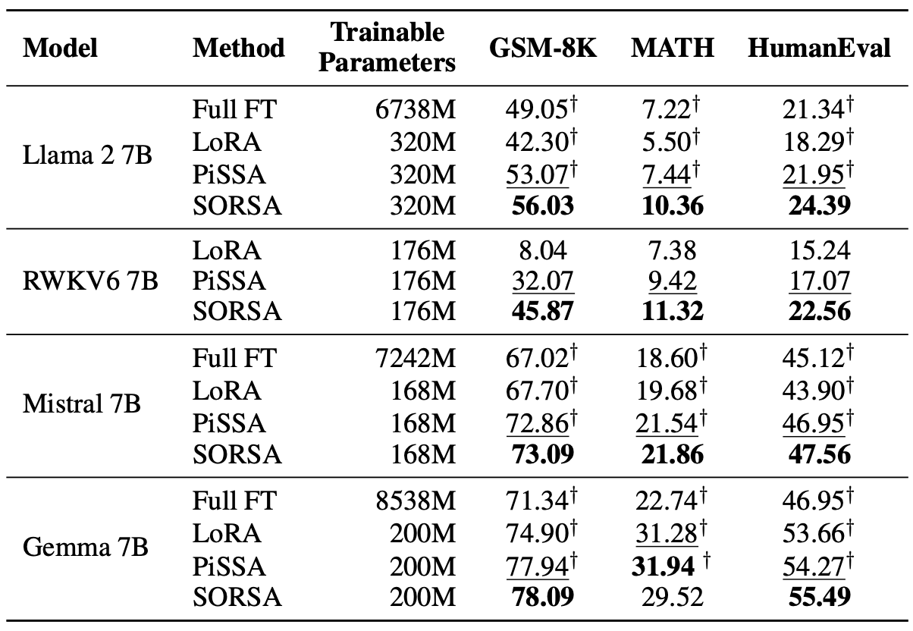

# SORSA: Singular Values and Orthonormal Regularized Singular Vectors Adaptation of Large Language Models

[](https://arxiv.org/abs/2409.00055)

This repository contains the codes of experiments of the paper *SORSA: Singular Values and Orthonormal Regularized Singular Vectors Adaptation of Large Language Models*.


The rapid advancement in large language models (LLMs) comes with a significant increase in their parameter size, presenting challenges for adaptation and fine-tuning. Parameter-efficient fine-tuning (PEFT) methods are widely used to adapt LLMs for downstream tasks efficiently. In this paper, we propose Singular Values and Orthonormal Regularized Singular Vectors Adaptation, or SORSA, a novel PEFT method. Each SORSA adapter consists of two main parts: trainable principal singular weights $W_p = U_p \text{diag}(S_p) V^\top_p$, and frozen residual weights $W_r = U_r \text{diag}(S_r) V^\top_r$. These parts are initialized by performing SVD on pre-trained weights. Moreover, we implement and analyze an orthonormal regularizer. SORSA adapters could be merged during inference, thus eliminating any inference latency.

## Empirical Experiments




## Reproduce the Experiments

### Llama 2 7B, Mistral v0.1 7B and Gemma 7B

First, install the packages via anaconda

```bash
conda env create -f environment.yml
```

Run scripts from `./scripts/train_sorsa.sh` to train the model.

After training, run the ``./scripts/merge_sorsa.sh`` to merge the adapter to the base model:

Run following command to evaluate on GSM-8K:

```bash
python3 run.py --name llama2_sorsa_r128 \
  --test \
  --test-dataset gsm-8k \
  --test-precision bf16
```

Run following command to evaluate on MATH:

```bash
python3 run.py --name llama2_sorsa_r128 \
  --test \
  --test-dataset math \
  --test-precision bf16
```

Run following command to evaluate on HumanEval:

```bash
python3 run.py --name llama2_sorsa_r128 \
  --test \
  --test-dataset humaneval \
  --test-precision bf16
```

### RWKV6

If you are training, merging or testing RWKV6 model, please add `--rwkv` flag to `run.py`.

## Cite the work

You could cite the work by using the BibTeX Code in `CITATION.bib`.
