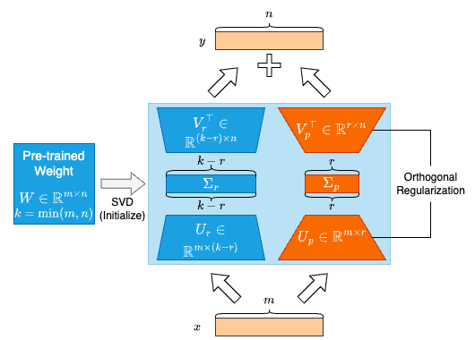

# SORSA: Singular Values and Orthonormal Regularized Singular Vectors Adaptation of Large Language Models

This repository contains the source code of experiments we conducted in the paper.



SORSA is a novel PEFT method. A SORSA layer consists of two main parts: trainable principle singular weights $W_p = U_p \Sigma_p V^\top_p$, and frozen residual weights $W_r = U_r \Sigma_r V^\top_r$. These parts are initialized by performing singular value decomposition (SVD) on pre-trained weights. SORSA layers could be merged during inference, thus eliminating inference latency.

## Empirical Test Results

### Llama 2-7B

| Method  | Trainable<br />Parameters | GSM-8K       | MATH        |
| ------- | ------------------------- | ------------ | ----------- |
| Full FT | 6738M                     | 49.05        | 7.22        |
| LoRA    | **320M**                  | 42.30        | 5.50        |
| PiSSA   | **320M**                  | <u>53.07</u> | <u>7.44</u> |
| SORSA   | **320M**                  | **57.24**    | **10.20**   |


## Experiments on Llama 2-7B

First, install the packages via anaconda

```bash
conda env create -f environment.yml
```

Download the MetaMathQA dataset from [huggingface](https://huggingface.co/datasets/meta-math/MetaMathQA) and put into `./datasets` folder.

Run the `run.py` to train:

```bash
python3 run.py --run-path ./runs --name Llama2_SORSA_r128 --model meta-llama/Llama-2-7b-hf --lr 3e-5 --wd 0.00 --batch-size 2 --accum-step 64 --gamma 5e-4  --rank 128 --epochs 1 --train --bf16 --tf32
```

After training, run the following command to merge the adapter to the base model:

```bash
python3 run.py --run-path ./runs --name Llama2_SORSA_r128 --merge
```

Run following command to evaluate on GSM-8K:

```bash
python3 run.py --run-path ./runs --name Llama2_SORSA_r128 --test --gsm-8k --bf16
```

Run following command to evaluate on MATH:

```bash
python3 run.py --run-path ./runs --name Llama2_SORSA_r128 --test --math --bf16
```

## Cite the work

You could cite the work by using the following BibTeX Code:

```bibtex

@software{sorsa,
	author = {Cao, Yang},
	shorttitle = {SORSA},
	title = {SORSA: Singular Values and Orthonormal Regularized Singular Vectors Adaptation of Large Language Models},
	url = {https://github.com/Gunale0926/SORSA},
	year = {2024},
	version = {0.0.1}
}

```

