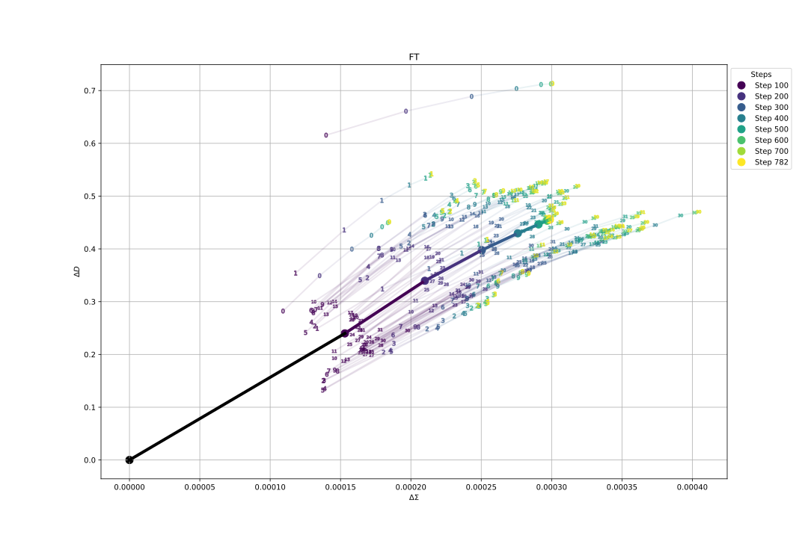
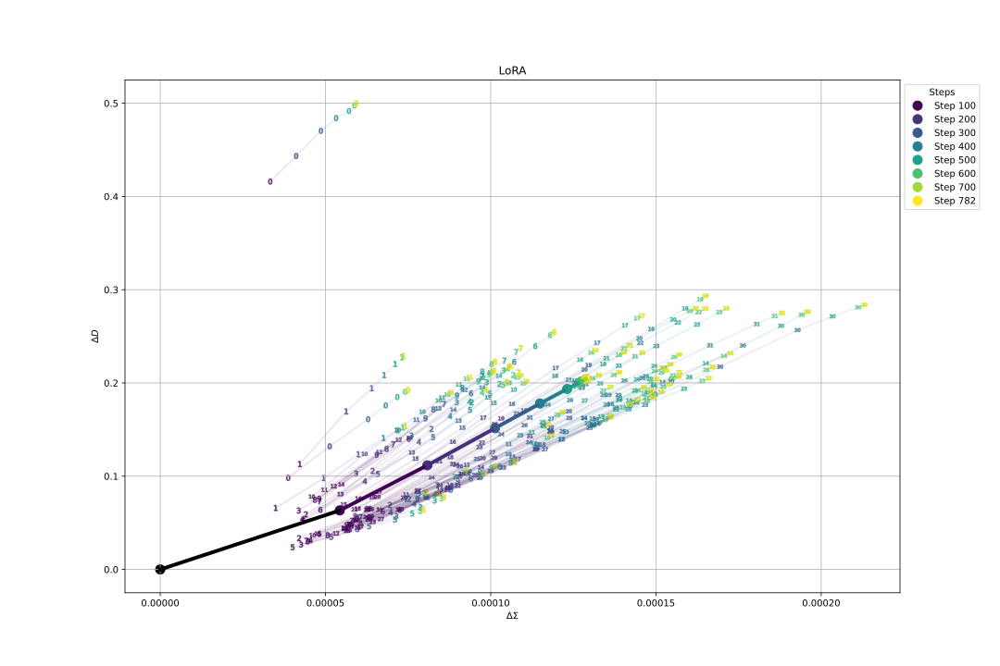
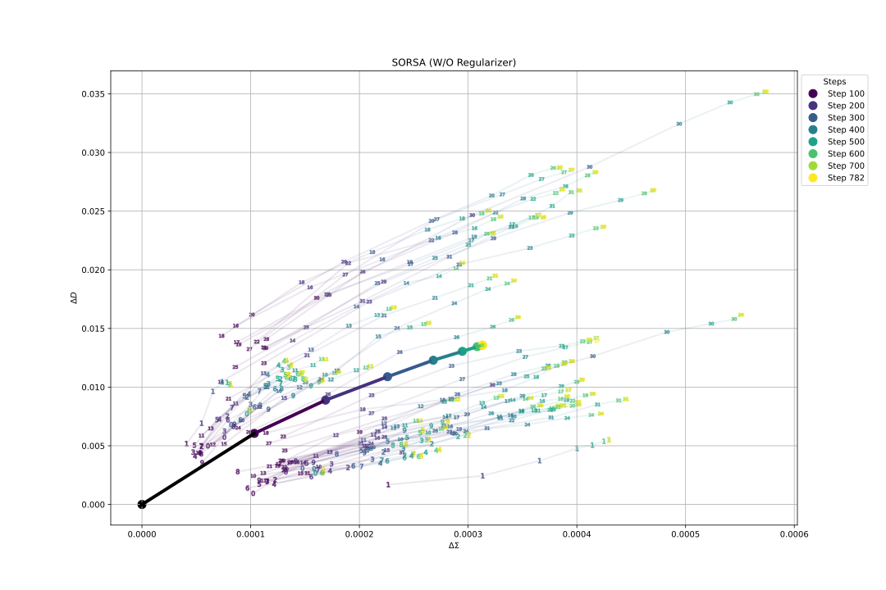
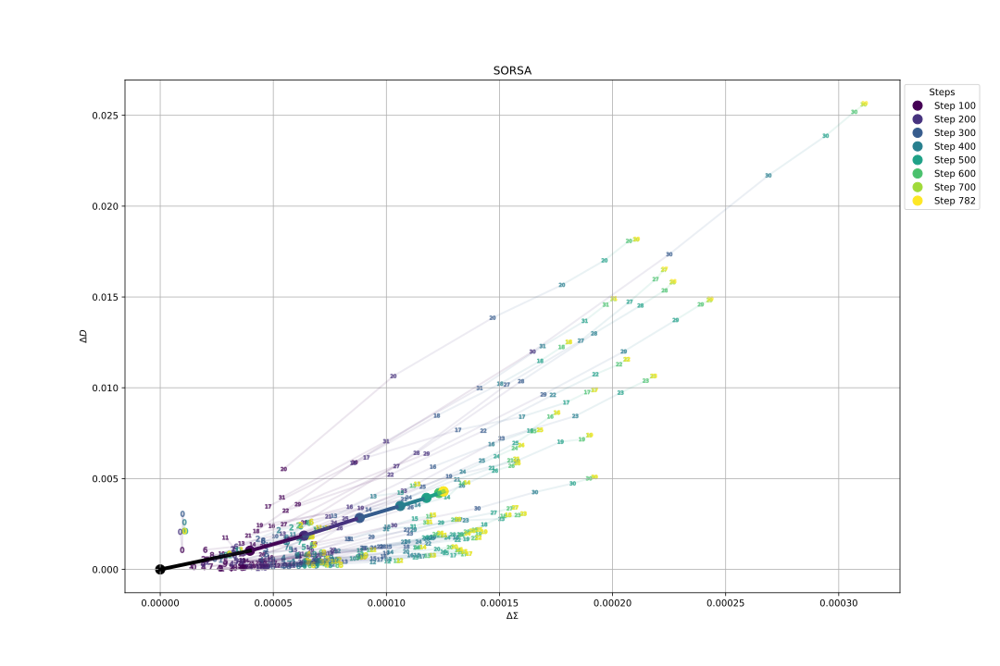

# SORSA: Singular Values and Orthogonal Regularized Singular Vectors Adaptation of Large Language Models

This repository contains the source code of experiments we conducted in the paper.


SORSA is a novel universal PEFT method. A SORSA layer consists of two main parts: principle singular weights $W_p = U_p \Sigma_p V^\top_p$ which is freezing during the training, and residual weights $W_r = U_r \Sigma_r V^\top_r$ which are trainable. While training, $U_p$, and $V^\top_p$ are regularized by an orthogonal regularizer.

## Empirical Test Results

### Llama 2-7B

| Method  | Trainable<br />Parameters | GSM-8K       | MATH        |
| ------- | ------------------------- | ------------ | ----------- |
| Full FT | 6738M                     | 49.05        | 7.22        |
| LoRA    | **320M**                  | 42.30        | 5.50        |
| PiSSA   | **320M**                  | <u>53.07</u> | <u>7.44</u> |
| SORSA   | **320M**                  | **55.98**    | **8.44**    |


## Analysis

In our analysis, SORSA with regularizer demonstrates superior stability and the least singular vectors variation among methods we draw in our experiments.









## Experiments on Llama 2-7B

First, install the packages via anaconda

```bash
conda env create -f environment.yaml
```

Download the MetaMathQA dataset from [huggingface](https://huggingface.co/datasets/meta-math/MetaMathQA) and put into `./llama/datasets` folder.

Run the `run.py` to train:

```bash
python3 run.py --run-path ./runs --name Llama2_SORSA_r128  --lr 0.00003 --wd 0.01 --batch-size 2 --accum-step 64 --gamma 0.3  --rank 128 --epochs 1 --train
```

Run following command to evaluate on GSM-8K:

```bash
python3 run.py --run-path ./runs --name Llama2_SORSA_r128 --test --gsm-8k
```

Run following command to evaluate on MATH:

```bash
python3 run.py --run-path ./runs --name Llama2_SORSA_r128 --test --math
```

## Cite the work

You could cite the work by using the following BibLaTeX Code:

```

@software{SORSASingularValues,
	author = {Cao, Yang},
	shorttitle = {SORSA},
	title = {SORSA: Singular Values and Orthogonal Regularized Singular Vectors Adaptation of Large Language Models},
	url = {https://github.com/Gunale0926/SORSA},
	version = {0.0.1}
}

```

