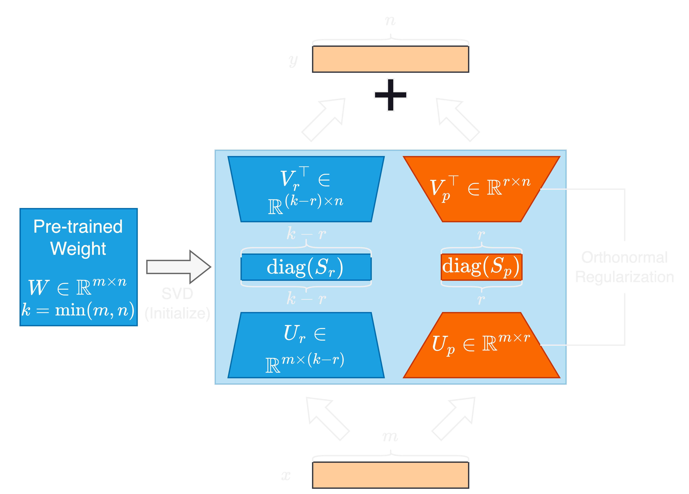

# SORSA: Singular Values and Orthonormal Regularized Singular Vectors Adaptation of Large Language Models

[](https://arxiv.org/abs/2409.00055)

This repository contains the codes of experiments of the paper *SORSA: Singular Values and Orthonormal Regularized Singular Vectors Adaptation of Large Language Models*.



Singular Values and Orthonormal Regularized Singular Vectors Adaptation, or **SORSA**, is a novel PEFT method. Each SORSA layer consists of two main parts: trainable principal singular weights $W_p = U_p \Sigma_p V^\top_p$, and frozen residual weights $W_r = U_r \Sigma_r V^\top_r$. These parts are initialized by performing singular value decomposition (SVD) on pre-trained weights. Moreover, we implement an orthonormal regularizer, which could effectively transfer the scaling information into $\Sigma_p$, that ensures the parameter updating of SORSA layers is evenly and minimized on $U_p$ and $V^\top_p$. SORSA layers could be merged during inference, thus eliminating inference latency. After all, SORSA shows a faster convergence speed than PiSSA and LoRA in our experiments.

## Empirical Test Results

### Llama 2 7B

| Method  | Trainable<br />Parameters | MATH        | GSM-8K       |
| ------- | ------------------------- | ----------- | ------------ |
| Full FT | 6738M                     | 7.22        | 49.05        |
| LoRA    | **320M**                  | 5.50        | 42.30        |
| PiSSA   | **320M**                  | <u>7.44</u> | <u>53.07</u> |
| SORSA   | **320M**                  | **10.36**   | **56.03**    |

### Mistral 7B v0.1

| Method  | Trainable<br />Parameters | MATH         | GSM-8K      |
| ------- | ------------------------- | ------------ | ----------- |
| Full FT | 7242M                     | 18.60        | 67.02       |
| LoRA    | **168M**                  | 19.68        | 67.70       |
| PiSSA   | **168M**                  | <u>21.54</u> | <u>72.86</u>|
| SORSA   | **168M**                  | **21.86**    | **73.09**   |


## Reproduce the Experiments

First, install the packages via anaconda

```bash
conda env create -f environment.yml
```

Download the MetaMathQA dataset from [huggingface](https://huggingface.co/datasets/meta-math/MetaMathQA) and put into `./datasets` folder.

Run the `run.py` using hyperparameters in the paper to train:

```bash
python3 run.py --run-path ./runs --name llama2_sorsa_r128 --model meta-llama/Llama-2-7b-hf --lr 3e-5 --wd 0.00 --batch-size 2 --accum-step 64 --gamma 4e-4  --rank 128 --epochs 1 --train --bf16 --tf32
```

After training, run the following command to merge the adapter to the base model:

```bash
python3 run.py --run-path ./runs --name llama2_sorsa_r128 --merge
```

Run following command to evaluate on GSM-8K:

```bash
python3 run.py --run-path ./runs --name llama2_sorsa_r128 --test --gsm-8k --bf16
```

Run following command to evaluate on MATH:

```bash
python3 run.py --run-path ./runs --name llama2_sorsa_r128 --test --math --bf16
```


## Cite the work

You could cite the work by using the following BibTeX Code:

```bibtex
@misc{cao2024sorsasingularvaluesorthonormal,
      title={SORSA: Singular Values and Orthonormal Regularized Singular Vectors Adaptation of Large Language Models}, 
      author={Yang Cao},
      year={2024},
      eprint={2409.00055},
      archivePrefix={arXiv},
      primaryClass={cs.LG},
      url={https://arxiv.org/abs/2409.00055}, 
}
```

